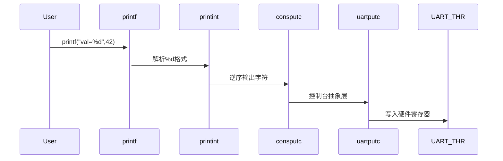
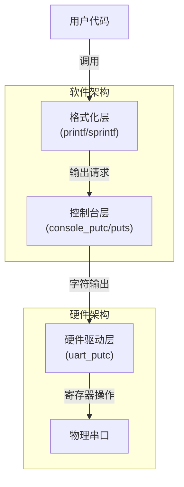
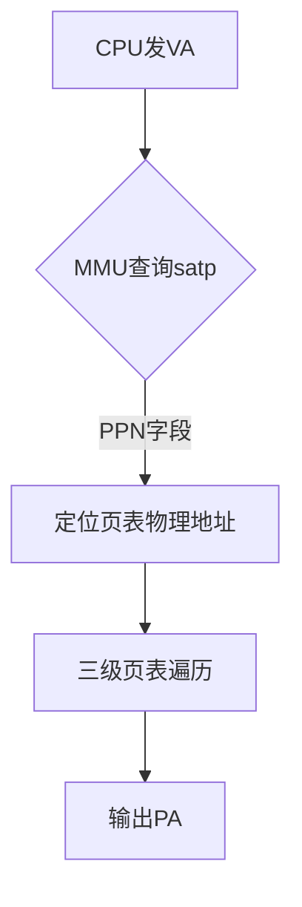
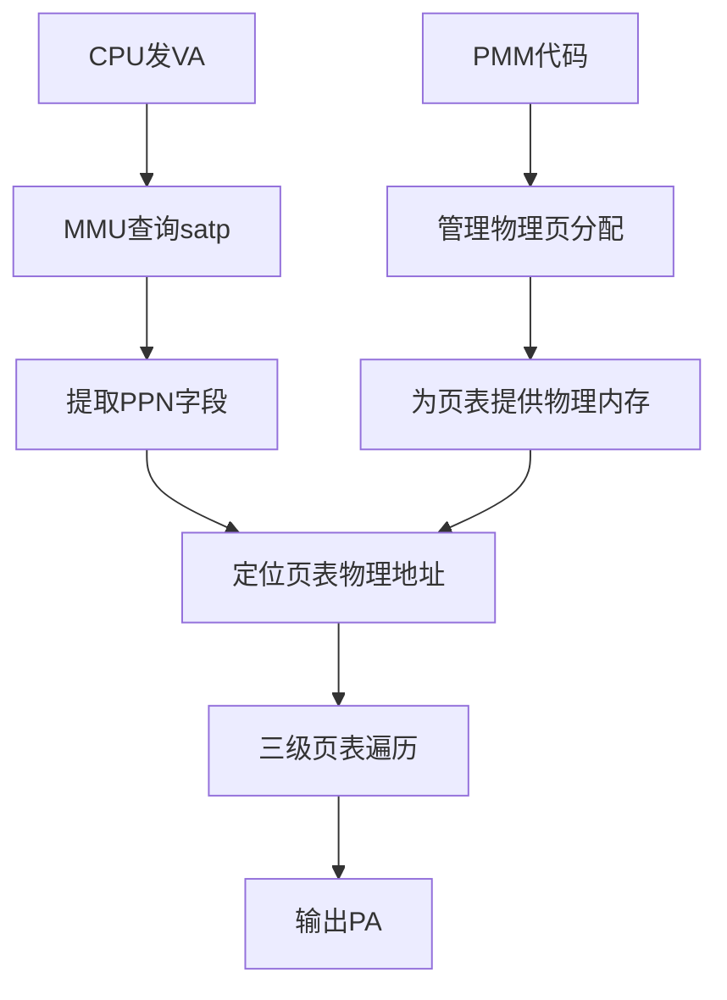
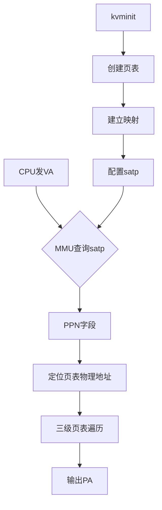
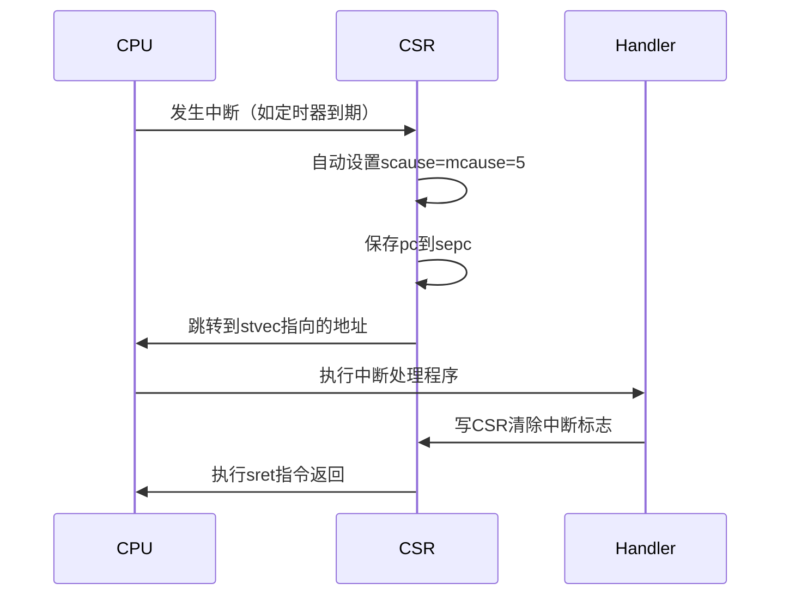
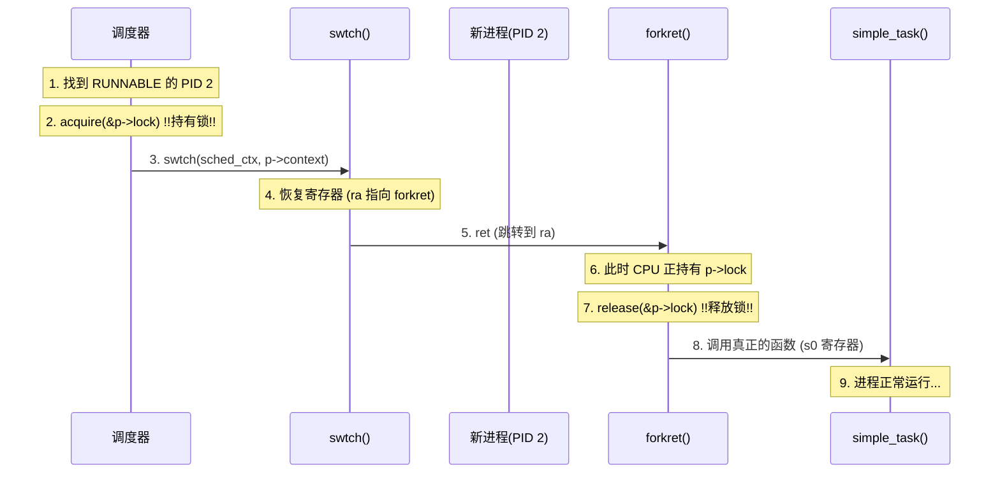

# 操作系统实践

## 硬件知识

### CSR寄存器（控制与状态寄存器）

#### 异常 / 中断控制类寄存器

| 寄存器    | 作用                     | 示例值             |
| :-------- | :----------------------- | :----------------- |
| `stvec`   | 中断处理入口地址         | 0x8000_0000        |
| `scause`  | 中断/异常原因码          | 0x8000_0005 (时钟) |
| `sepc`    | 中断返回地址             | 用户程序PC         |
| `stval`   | 异常附加信息             |                    |
| `sie/sip` | 中断使能/中断待处理 掩码 | 0x222 (允许所有)   |
| `sstatus` | 核心控制状态寄存器       |                    |

这些寄存器的结构：

```c
// stvec
63                    2 1      0
|      BASE[63:2]      |   MODE   |
    
BASE：陷阱处理程序基地址
MODE：
	00：Direct模式（所有陷阱跳转到BASE）
	01：Vectored模式（异步中断跳转到BASE + 4*cause）   
// scause
63                | 62        0
 Interrupt Flag   |   Exception Code
Interrupt Flag：
	1：当前是中断
	0：当前是异常
// sepc
63                    0
|      PC[63:0]        |
保存陷阱发生时的指令地址											
// sie
63      12 11 10 9 8 7 6 5 4 3 2 1 0
| Reserved | ME| SE| UE| MT| ST| UT| MS| SS| US|
控制S-Mode下的中断使能
// sstatus
63      34 33  32 31  30 29  28 19 18  17 16  15 14  13 12  11 10  9 8   7 6   5 4   3 2   1 0
| WPRI | SD | UXL | WPRI | MXR | SUM | WPRI | XS | FS | WPRI | SPP | WPRI | SPIE | UPIE | WPRI | SIE | UIE |
```


| 位域 | 名称   | 作用                   | 典型值                               |
| :--- | :----- | :--------------------- | :----------------------------------- |
| 1    | `UIE`  | 用户模式中断使能       | `0`（S-mode通常禁用U-mode中断）      |
| 5    | `SIE`  | S-mode中断使能         | `1`（允许中断）                      |
| 8    | `SPIE` | 陷阱前SIE值            | 用于`sret`恢复                       |
| 18   | `SPP`  | 陷阱前特权级           | `0`（来自U-mode）或`1`（来自S-mode） |
| 19   | `FS`   | 浮点状态               | `00`（关闭）或`11`（脏状态）         |
| 20   | `XS`   | 扩展状态               | 类似`FS`，用于自定义扩展             |
| 21   | `SUM`  | 允许S-mode访问用户内存 | `1`（允许）                          |
| 22   | `MXR`  | 使不可执行内存可读     | `0`（默认禁用）                      |

#### 内存管理类寄存器

| 寄存器    | 作用                                                         |
| --------- | ------------------------------------------------------------ |
| `satp`    | （1）启用 / 关闭虚拟内存（2）指定当前页表的根页表物理地址（3）指定地址转换模式（Sv39 / Sv48 等）（4）区分不同地址空间 |
| `sstatus` |                                                              |


#### 上下文保存类寄存器

| 寄存器     | 作用                                                  |
| ---------- | ----------------------------------------------------- |
| `sscratch` | 让操作系统在异常/中断入口时，能安全地暂存一个寄存器值 |


## Task 1

取消/打开图形化界面

```bash
sudo systemctl isolate multi-user.target

sudo systemctl isolate graphical.target
```

查看各个段的布局

```bash
riscv64-unknown-elf-objdump -h kernel.elf
```

显示ELF文件的段头信息，查看各个段（section）的内存布局

```bash
riscv64-unknown-elf-nm kernel.elf
```

分解说明：

1. `riscv64-unknown-elf-nm kernel.elf`：
   - nm命令：显示ELF文件的符号表
   - 列出所有符号（函数、变量）及其地址
2. `grep -E "(start|end|text)"`：
   - grep：过滤输出
   - -E：使用扩展正则表达式
   - "(start|end|text)"：匹配包含start、end或text的行

```bash
# 步骤1：编译汇编文件
riscv64-unknown-elf-gcc -c entry.S -o entry.o

# 步骤2：编译C文件
riscv64-unknown-elf-gcc -c main.c -o main.o

# 步骤3：链接所有目标文件
riscv64-unknown-elf-ld -T kernel.ld entry.o main.o -o kernel.elf

# 步骤4：现在可以运行分析命令了
riscv64-unknown-elf-objdump -h kernel.elf
riscv64-unknown-elf-nm kernel.elf | grep -E "(start|end|text)"
```


### 串口需要配置的寄存器

对于NS16550A兼容UART（QEMU virt使用）：

基地址： `0x10000000`

必需配置的寄存器：

#### 1. 线路控制寄存器 (LCR) - 偏移 0x03

```c
#define UART_LCR_8N1 0x03  // 8数据位，无校验，1停止位
*((volatile uint8_t*)(0x10000003)) = UART_LCR_8N1;
```

#### 2. FIFO控制寄存器 (FCR) - 偏移 0x02

```c
#define UART_FCR_ENABLE_FIFO 0x01  // 启用FIFO
#define UART_FCR_CLEAR_RCVR 0x02   // 清接收FIFO
#define UART_FCR_CLEAR_XMIT 0x04   // 清发送FIFO
*((volatile uint8_t*)(0x10000002)) = UART_FCR_ENABLE_FIFO | UART_FCR_CLEAR_XMIT | UART_FCR_CLEAR_RCVR;
```

#### 3. 发送保持寄存器 (THR) - 偏移 0x00（用于发送数据）

```c
void uart_putc(char c) {
    *((volatile uint8_t*)(0x10000000)) = c;
}
```

#### 4. 线路状态寄存器 (LSR) - 偏移 0x05（用于检查状态）

```c
#define UART_LSR_TX_READY 0x20  // 发送寄存器空
int uart_tx_ready() {
    return *((volatile uint8_t*)(0x10000005)) & UART_LSR_TX_READY;
}
```

最简串口初始化函数：

```c
void uart_init() {
    // 1. 配置数据格式：8N1
    *((volatile uint8_t*)(0x10000003)) = 0x03;
    
    // 2. 启用并清空FIFO
    *((volatile uint8_t*)(0x10000002)) = 0x07;
    
    // 3. 现在可以通过THR(0x10000000)发送数据了
}
```

使用示例：

```c
void print(const char *s) {
    while (*s) {
        while (!uart_tx_ready());  // 等待就绪
        uart_putc(*s++);
    }
}
```

这样就能实现最基本的串口输出功能，用于调试和状态显示。


### 关键寄存器说明

|  寄存器  |      作用      |       设置值       |
| :------: | :------------: | :----------------: |
| mstatus  | 机器状态和控制 |   MPP=Supervisor   |
|   mepc   |  异常返回地址  |    main函数地址    |
|   satp   |  地址转换设置  |   0（禁用分页）    |
| medeleg  |    异常委托    | 0xffff（全部委托） |
| mideleg  |    中断委托    | 0xffff（全部委托） |
| pmpcfg0  |  内存保护配置  |   0xf（全权限）    |
| pmpaddr0 |  保护区域地址  |    最大物理地址    |
|   mie    |  机器中断使能  | STIE（定时器中断） |
| stimecmp |   定时比较值   | 当前时间+100万周期 |


### QEMU virt 机器的内存映射布局

```c
// QEMU virt 机器的内存映射布局
0x00000000 - 0x7FFFFFFF: RAM 内存
0x80000000 - 0x8FFFFFFF: 内核代码和数据
0x10000000 - 0x1000FFFF: UART 串口设备 ← 这里
0x20000000 - 0x2000FFFF: 其他硬件设备
```

### 内存布局可视化

```bash
0x80000000: +----------------+
            |   _entry       | ← 入口代码
            |   .text        | ← 代码段
            +----------------+
            |   _trampoline  | ← 跳板代码（4KB）
            +----------------+
            |   .rodata      | ← 只读数据
            +----------------+
            |   .data        | ← 已初始化数据
            +----------------+
            |   .bss         | ← 未初始化数据
            +----------------+
end →       |                | ← 内存结束
            +----------------+
```


### 关键函数调用链




### 测试流程

```bash
# 编译
# 编译生成可执行文件，比如kernel.elf
make clean
make

# 运行QEMU
qemu-system-riscv64 -machine virt -kernel kernel.elf -nographic

#qemu-system-riscv64 \
#    -machine virt \           # 机器类型
#    -kernel kernel.elf \      # 要加载的内核
#    -nographic \              # 无图形界面
#    -serial mon:stdio \       # 串口重定向
#    -display none            # 禁用显示

# 预期输出
=== MiniOS Boot Success ===
Hello from C main function!
BSS segment cleared successfully
.
.
.  # 每隔一段时间输出一个点，表示系统正常运行
```


### 理解任务

我们可以将整个过程分为两个阶段：编译链接阶段 和 运行阶段。

1. 编译链接阶段 (由 `Makefile` 控制)

虽然你没有提供 `Makefile` 的内容，但它的作用是整个项目的“总指挥”。它会按顺序执行以下步骤：

1. 编译 (Compilation)：
   - 调用编译器（如 `riscv64-unknown-elf-gcc`）将 `main.c` 和 `uart.c` 编译成目标文件 `main.o` 和 `uart.o`。
   - 调用汇编器（`as`）将 `entry.S` 汇编成目标文件 `entry.o`。
2. 链接 (Linking)：
   - 调用链接器（`ld`）将所有目标文件 (`entry.o`, `main.o`, `uart.o`) 链接在一起。
   - 关键点：在这一步，链接器会读取 `kernel.ld` 文件。这个文件就像一张“蓝图”，告诉链接器如何组织和放置所有代码和数据。
   - `kernel.ld` 指示链接器：
     - 将程序的起始地址（`.`）设置为 `0x80200000`。
     - 将所有文件的代码段 (`.text`)、只读数据段 (`.rodata`)、数据段 (`.data`) 依次排列。
     - 定义了三个非常重要的符号（地址）：`_bss_start`、`_bss_end` 和 `stack_top`。这些符号本身不是变量，而是内存地址的“标签”。`entry.S` 和 `main.c` 会用到这些地址。
   - 最终，链接器生成一个单一的可执行文件（例如 `kernel.elf`）。


2. 运行阶段 (程序启动后的执行流)

当系统（比如 QEMU 模拟器或真实硬件）加载并跳转到 `0x80200000` 地址时，执行流程开始：

Step 1: 进入汇编入口 (`entry.S`)

- 处理器从 `_start` 标签处开始执行第一条指令。这是整个内核的唯一入口。
- 打印 'S'：直接向 UART 的发送寄存器（地址 `0x10000000`）写入字符 'S'。这是一种非常原始的调试方法，用于确认程序已经开始运行。
- 设置栈指针 `sp`：执行 `la sp, stack_top`。它从链接脚本 `kernel.ld` 中获取 `stack_top` 的地址，并将其加载到栈指针寄存器 `sp`。这是至关重要的一步，没有栈，就无法调用函数（包括 C 函数 `main`）。
- 打印 'P'：表示栈指针（Stack Pointer）设置完成。
- 清零 BSS 段：
  - 将 `kernel.ld` 定义的 `_bss_start` 和 `_bss_end` 地址加载到寄存器 `a0` 和 `a1` 中。
  - 调用 `entry.S` 文件中自己定义的 `clear_bss` 汇编函数。
  - 该函数循环地将 `a0` 到 `a1` 之间的内存区域全部写入 0。这是 C 语言标准所要求的，确保所有未初始化的全局变量和静态变量的初始值为 0。
- 打印 'B'：表示 BSS 段清零完成。
- 跳转到 C 函数：执行 `call main`。此时，底层的硬件和内存环境已经准备就绪，控制权正式从汇编代码移交给 C 代码。

```
t=0ns:   CPU上电，所有电路复位
t=100ns: 时钟稳定，CPU开始取指
t=200ns: 执行ROM中的固件代码
t=500ns: DRAM控制器初始化完成
t=1μs:   外设初始化完成
t=10μs:  加载kernel.elf到内存
t=11μs:  设置PC=0x80000000
t=12μs:  开始执行_entry代码
```


Step 2: 执行 C 主函数 (`main.c`)

- `main` 函数开始执行。
- `clear_bss()`：这里再次调用了一个 C 语言版本的 `clear_bss` 函数，功能与汇编版本相同。这其实是冗余的，因为 `entry.S` 已经做过一次了。在实际项目中通常只保留一个。
- `uart_init()`: 调用 `uart.c` 中的 `uart_init` 函数。这个函数不再是像汇编里那样粗暴地写数据，而是对 UART 控制器进行标准化配置（如设置 8-N-1 数据格式、启用 FIFO 缓冲区等），为后续可靠的串口通信做准备。
- `uart_puts(...)`: 多次调用 `uart.c` 中的 `uart_puts` 函数，通过已初始化的 UART，向外部（如电脑终端）打印欢迎字符串。
- `while (1)`: 进入一个无限循环。这标志着内核初始化完成，并进入了主循环（或称 idle 循环）。在一个真正的操作系统中，这里会进行任务调度等复杂操作。在这个迷你内核中，它只是通过不断计数并在特定时间打印一个 `.` 字符，来形成一个“呼吸灯”效果，向外界证明“我还活着”。

Step 3: 使用 UART 驱动 (`uart.c`)

- `main.c` 中所有 `uart_` 前缀的函数调用，其实现都在 `uart.c` 中。
- `uart.c` 封装了与 UART 硬件直接交互的底层细节：
  - `uart_init`：配置控制寄存器。
  - `uart_putc`：发送单个字符。它会先检查 UART 的线路状态寄存器（LSR），通过“忙等待”（Busy-waiting）的方式，直到确认发送器准备就绪，才将字符写入发送保持寄存器（THR）。
  - `uart_puts`：循环调用 `uart_putc` 来发送整个字符串。

Step 4: 安全保障 (`entry.S`)

- 在 `entry.S` 中，`call main` 指令的后面紧跟着一个死循环 `spin: j spin`。这是一个保护措施。按照设计，`main` 函数永远不应该返回。但万一由于代码错误 `main` 返回了，如果没有这个死循环，CPU 就会继续执行 `main` 函数之后的内存里的随机数据，导致系统崩溃。有了 `j spin`，即使 `main` 意外返回，CPU 也会被“困”在这个安全循环里，而不会“跑飞”。

各文件角色总结

- `kernel.ld` (内存布局蓝图)
  - 职责：定义程序的内存布局，确定代码和数据的存放位置。
  - 提供给其他文件：程序的起始地址、`_bss_start`、`_bss_end`、`stack_top` 等重要的内存地址标签。
- `entry.S` (启动引导程序)
  - 职责：作为程序的入口点，进行最底层的硬件和内存初始化，为 C 环境的运行搭建舞台。
  - 工作：设置栈指针 -> 清理 BSS 段 -> 跳转到 `main` 函数。
- `main.c` (内核主逻辑)
  - 职责：实现操作系统的高层逻辑。
  - 工作：初始化硬件驱动 -> 输出信息 -> 进入系统主循环。
- `uart.c` (硬件驱动程序)
  - 职责：封装对 UART 硬件的所有底层操作，为其他 C 代码提供简洁的接口（API）。
  - 工作：提供 `uart_init`, `uart_putc`, `uart_puts` 等函数。
- `Makefile` (项目构建工具)
  - 职责：自动化整个编译、汇编、链接的过程，将所有源文件正确地组合成一个最终的可执行文件。


## Task 2




设计对比

| 特性     | xv6实现    | 本设计           | 改进点                  |
| :------- | :--------- | :--------------- | :---------------------- |
| 缓冲区   | 无         | 可选环形缓冲区   | 提高吞吐量              |
| 错误处理 | 简单panic  | 格式错误回调函数 | 更灵活的错误恢复        |
| 线程安全 | 全局自旋锁 | 分层锁控制       | 减少锁争用              |
| 扩展功能 | 基础功能   | ANSI控制序列支持 | 支持清屏/颜色等高级功能 |
| 性能优化 | 直接输出   | 批量发送优化     | 减少中断次数            |


## Task 3

计入页表后的内存分布

```bash
0x80000000 ┌───────────────┐
           │    内核代码    │
           ├───────────────┤
           │    内核数据    │
           ├───────────────┤
           │   页表/结构   │
           ├───────────────┤
0x88000000 └───────────────┘
```

页表基址定位

> 这张流程图非常精准地概括了RISC-V Sv39架构下，CPU的内存管理单元 (MMU) 是如何将虚拟地址 (VA) 转换为物理地址 (PA) 的硬件过程:



### 对流程图的理解

这张图描述的是一次“页表遍历” (Page Walk) 的过程。

1. CPU发VA (CPU发出虚拟地址)

- 当您的操作系统启用了分页后，CPU执行的任何访存指令（如读取变量、跳转到函数地址）所使用的地址都是虚拟地址。
- 这个虚拟地址会被CPU发送给MMU。

2. MMU查询satp (MMU查询`satp`寄存器)

- MMU是CPU内部负责地址翻译的硬件单元。它拿到虚拟地址后的第一件事，就是去读取一个名为 `satp` 的特殊寄存器。
- `satp` (Supervisor Address Translation and Protection) 寄存器是整个地址翻译的起点。它由操作系统在启用分页前设置好，里面包含了根页表（在Sv39中是一级页表）所在的物理页号 (PPN)。

3. 定位页表物理地址

- MMU从 `satp` 中提取出PPN字段。
- 根据RISC-V的规则，物理页地址 = `PPN << 12`（即PPN左移12位，末尾补12个0）。
- 这样，MMU就计算出了一级页表在物理内存中的确切起始地址。

4. 三级页表遍历 (Page Walk) 这是整个流程最核心的部分。MMU会进行三次对物理内存的访问，以逐级“解码”虚拟地址。

- 第一级查询:
  1. MMU从虚拟地址中提取出一级索引 VPN[2] (VA的38-30位)。
  2. 它访问物理内存，地址为 `(一级页表基地址) + (VPN[2] * 8)`，读取一个8字节的一级页表项 (PTE)。
  3. 这个PTE中包含了二级页表所在的物理页号 (PPN)。
- 第二级查询:
  1. MMU利用上一步得到的PPN，计算出二级页表的物理基地址。
  2. 从虚拟地址中提取出二级索引 VPN[1] (VA的29-21位)。
  3. 访问物理内存，地址为 `(二级页表基地址) + (VPN[1] * 8)`，读取一个二级PTE。
  4. 这个PTE中包含了三级页表所在的物理页号 (PPN)。
- 第三级查询 (最后一级):
  1. MMU利用上一步得到的PPN，计算出三级页表的物理基地址。
  2. 从虚拟地址中提取出三级索引 VPN[0] (VA的20-12位)。
  3. 访问物理内存，地址为 `(三级页表基地址) + (VPN[0] * 8)`，读取一个三级PTE。
  4. 这是一个叶子PTE，它不再指向下一级页表，而是包含了最终数据页所在的物理页号 (PPN)。同时，MMU会检查这个PTE中的权限位（读/写/执行等）。

5. 输出PA (输出物理地址)

1. MMU从最后的三级PTE中提取出最终的PPN。
2. 计算出数据页的物理基地址：`最终PPN << 12`。
3. 将这个基地址与原始虚拟地址中的页内偏移 (Offset) (VA的11-0位) 进行拼接。
4. 得到最终的物理地址，MMU用这个地址去访问真正的物理内存（RAM）。

重要补充：TLB 这个三级遍历过程需要多次访问内存，速度很慢。因此，CPU内部有一个高速缓存叫做 TLB (Translation Lookaside Buffer)。MMU在查询`satp`之前，会先在TLB中查找该虚拟地址是否已经被翻译过。如果命中 (TLB Hit)，则直接从TLB获取物理地址，跳过整个慢速的页表遍历过程。只有当TLB未命中 (TLB Miss) 时，才会执行上述的完整流程。

### 一个实际的地址转换例子


假设我们有以下场景：

- 要翻译的虚拟地址 (VA): `0xDEAD_BEEF`
- `satp` 寄存器中的PPN: `0x10000` (表示一级页表位于物理地址 `0x10000000`)


第1步：分解虚拟地址

VA: `0x0000_DEAD_BEEF` (为了清晰，写成64位)

换算成二进制 (只看低39位): `000_1101_1110_1010_1101_1011_1110_1110_1111` `| VPN[2] |  VPN[1]  |  VPN[0]  |     Offset      |` `|000110111|101010110|110110111|11011101111|`

- VPN[2] (一级索引): `0b000110111` = `0x077`
- VPN[1] (二级索引): `0b101010110` = `0x156`
- VPN[0] (三级索引): `0b110110111` = `0x1AD`
- Offset (页内偏移): `0b111011101111` = `0xEEF`

第2步：一级查询

1. 从 `satp` 得知，一级页表基地址在 `0x10000 << 12` = `0x10000000`。
2. 要查找的PTE在一级页表中的位置是第 `0x077` 项。
3. MMU访问物理地址: `0x10000000 + (0x077 * 8)` = `0x100003B8`。
4. 假设MMU从物理内存的 `0x100003B8` 地址读取到的一级PTE内容是 `0x0000...C0001`。
   - `V`位是1，有效。
   - 提取PPN部分: `0x000...C0000 >> 10` = `0x3000`。
   - 这个 `0x3000` 是二级页表的物理页号。

第3步：二级查询

1. 二级页表的物理基地址是 `0x3000 << 12` = `0x3000000`。
2. 要查找的PTE在二级页表中的位置是第 `0x156` 项。
3. MMU访问物理地址: `0x3000000 + (0x156 * 8)` = `0x3000AB0`。
4. 假设MMU从物理内存的 `0x3000AB0` 地址读取到的二级PTE内容是 `0x0000...D0801`。
   - `V`位是1，有效。
   - 提取PPN部分: `0x000...D0800 >> 10` = `0x3420`。
   - 这个 `0x3420` 是三级页表的物理页号。

第4步：三级查询 (最后一级)

1. 三级页表的物理基地址是 `0x3420 << 12` = `0x3420000`。
2. 要查找的PTE在三级页表中的位置是第 `0x1AD` 项。
3. MMU访问物理地址: `0x3420000 + (0x1AD * 8)` = `0x3420D68`。
4. 假设MMU从 `0x3420D68` 读取到的三级PTE (叶子PTE) 是 `0x0000...FADEF`。
   - `V`位是1，有效。
   - `R,W,X,U`等权限位是 `0b1111` (`0xF`)，表示可读、可写、可执行、用户可访问。权限检查通过。
   - 提取最终的PPN: `0x000...FAC00 >> 10` = `0x3EAF`。
   - 这个 `0x3EAF` 是最终数据页的物理页号。

第5步：合成最终物理地址

1. 数据页的物理基地址是 `0x3EAF << 12` = `0x3EAF000`。
2. 原始虚拟地址中的页内偏移是 `0xEEF`。
3. 最终物理地址 (PA) = `0x3EAF000 + 0xEEF` = `0x3EAFEEF`。

至此，MMU成功将虚拟地址 `0xDEADBEEF` 翻译为了物理地址 `0x3EAFEEF`，并会使用这个物理地址去访问RAM。







### 深入理解Sv39页表机制

Sv39是一种为64位RISC-V架构定义的虚拟内存方案。这里的“39”意味着它使用39位的虚拟地址空间，总共可以寻址 239 字节，即512 GiB。

#### 1. 分析39位虚拟地址的分解

一个39位的虚拟地址（Virtual Address, VA）被MMU（内存管理单元）硬件分解如下：

```
| 63 ..... 39 |  38 .. 30  |  29 .. 21  |  20 .. 12  |  11 .. 0   |
|-------------|------------|------------|------------|------------|
|    Unused   |   VPN[2]   |   VPN[1]   |   VPN[0]   | Page Offset|
| (Must be 0) | (9 bits)   | (9 bits)   | (9 bits)   | (12 bits)  |
```

- Page Offset (页偏移):

  - 共12位，可以表示 212=4096 个字节。
  - 作用：它指定了在一个物理页（Page）内的具体字节地址。因为内存管理的最小单位是页（在Sv39中是4KiB），所以页内的地址不需要翻译，可以直接用于访问物理内存。在地址翻译的最后阶段，这个偏移量会原封不动地附加到翻译出的物理页号（PPN）后面。

- VPN[0], VPN[1], VPN[2] (虚拟页号 Virtual Page Number):

  - 这三段共同构成了虚拟地址的页号部分。在Sv39的三级页表结构中，每一段VPN都是一个索引。
  - 作用：
    1. VPN[2] (9位)：用作一级页表 (Level 1 Page Table) 的索引，以找到二级页表的地址。
    2. VPN[1] (9位)：用作二级页表 (Level 2 Page Table) 的索引，以找到三级页表的地址。
    3. VPN[0] (9位)：用作三级页表 (Level 3 Page Table) 的索引，以找到最终数据所在的物理页号 (PPN)。

  这个过程就像查字典：VPN[2]告诉你去翻第几“章”，VPN[1]告诉你翻到这一章的第几“节”，VPN[0]告诉你去翻这一节的第几“条”，最后Offset告诉你去读这一条里的第几个字。

#### 为什么每个VPN段是9位而不是其他位数？

这个设计是与页大小和页表项大小紧密相关的，是一个非常精妙的数学结果。

1. 页大小 (Page Size)：在Sv39中，一个标准的页是 4 KiB，即 4096 字节 (212 bytes)。

2. 页表项大小 (Page Table Entry, PTE Size)：在64位RISC-V中，一个PTE的大小是 8 字节 (23 bytes)。

3. 一个页能容纳多少PTE？：一个页表本身也存放在一个物理页中。所以，一个页表（一个物理页）可以容纳的PTE数量是：

   PTE SizePage Size=8 bytes4096 bytes=512 entries

4. 索引512个条目需要多少位？：为了能唯一地索引这512个PTE中的任意一个，需要的二进制位数是：

   2x=512⟹x=9

   因此，每个VPN段不多不少，正好需要 9位。这个设计使得每一级的页表都能恰好装满一个4KiB的物理页，极大地简化了内存管理和硬件设计。

#### 2. 理解页表项（PTE）格式

一个8字节（64位）的PTE包含了“翻译信息”（物理地址）和“权限控制”两部分。其简化结构如下：

```
| 63 .. 54 | 53 ...... 10 | 9 .. 8 | 7 | 6 | 5 | 4 | 3 | 2 | 1 | 0 |
|----------|--------------|--------|---|---|---|---|---|---|---|---|
| Reserved | PPN          | RSW    | D | A | G | U | X | W | R | V |
```

- V (Valid) 位: 有效位。

  - `V=1`：表示这个PTE是有效的，MMU可以继续使用它进行翻译。
  - `V=0`：表示这个PTE是无效的。如果MMU访问到一个V=0的PTE，会立即停止翻译并触发一个缺页异常 (Page Fault)，交由操作系统处理。

- R/W/X 位: 读/写/执行权限位。

  - `R=1`：允许读取 (Read) 该页。
  - `W=1`：允许写入 (Write) 该页。
  - `X=1`：允许执行 (Execute) 该页（即把该页内容当作指令）。
  - 这些权限位由MMU在每次内存访问时强制检查。例如，如果一个PTE的 `W=0`，而程序试图向该页写入数据，MMU就会触发一个缺页异常。这是实现内存保护（如只读代码段）的基础。

- U (User) 位: 用户态访问权限位。

  - `U=1`：允许用户模式 (U-Mode) 的代码访问该页。
  - `U=0`：只允许监管者模式 (S-Mode) 或更高权限的模式访问。
  - 这是实现操作系统内核空间与用户空间隔离的核心机制。内核可以将自己的页表项U位置0，从而防止用户程序意外或恶意地读写内核数据。

- 物理页号 (Physical Page Number, PPN):

  - PTE中最重要的部分，它存储了翻译后的物理页的地址。

  - 提取方式：将PTE中的PPN字段（bit 53到bit 10）提取出来，并在其末尾补上12个0，就得到了物理页的基地址。然后，将原始虚拟地址中的12位Offset部分拼接在这个基地址后面，就形成了最终的物理地址。

    Physical Address=[PPN from PTE] ∣ [Offset from VA]


### 深入思考

#### 为什么选择三级页表而不是二级或四级？

这是一个在空间开销和性能开销之间的经典权衡。

- 如果是一级页表：对于39位虚拟地址，页内偏移占12位，那么页号就有 39−12=27 位。这意味着需要一个包含 227 个条目的巨大页表。每个条目8字节，总大小为 227×8B=1GiB。为每一个进程都维护一个1GiB的页表是完全不可接受的。
- 多级页表的优势：它能极大地节省空间。对于一个典型的程序，其512GiB的虚拟地址空间中，大部分是未使用的。使用多级页表，如果一级页表中的某个条目是无效的，那么它所指向的整个二级页表（以及所有后续的三级页表）就完全不需要分配内存。这就实现了按需分配，只为实际使用的地址范围创建页表。
- 二级、三级还是四级？
  - 性能：每增加一级页表，地址翻译过程就可能需要多一次内存访问（从RAM中读取下一级页表的PTE）。二级页表比三级快，三级比四级快。
  - 空间：级别越多，页表的粒度越细，对于地址空间使用非常稀疏的程序，节省空间的效果越好。
  - 结论：三级页表 (Sv39) 被认为是64位系统下对于512GiB虚拟地址空间的一个良好折衷点。它比二级页表（仍然需要非常大的二级页表）更节省空间，又比四级页表（如Intel的5级页表或RISC-V的Sv48）在翻译时性能开销更小。当然，这个性能开销会被 TLB (Translation Lookaside Buffer) 极大地缓解，TLB会缓存最近的翻译结果，避免了大部分情况下的多次内存访问。

#### 中间级页表项的R/W/X位应该如何设置？

这是一个非常关键的细节。页表项（PTE）分为两种：

1. 叶子PTE (Leaf PTE)：指向最终的物理数据页。
2. 中间PTE (Non-leaf PTE)：指向下一级的页表。

RISC-V规范规定：对于中间PTE，其R, W, X位必须全部为0。

- 原因：这些权限位是用来描述数据页的属性的。而一个页表本身，既不是可读的数据（不能用`load`指令直接读），也不是可写的数据（不能用`store`指令直接写），更不是可执行的代码。对页表的访问是由MMU硬件在进行页表遍历（Page Walk）时隐式完成的。如果一个中间PTE的R/W/X位不为0，MMU会认为这是一个格式错误的PTE，并触发一个缺页异常。这是一种安全和规范性检查。

#### 如何理解"页表也存储在物理内存中"？

这是一个核心概念，初学者可能会觉得有点“鸡生蛋，蛋生鸡”的困惑。

1. 页表是数据结构：首先，要明确页表本身就是一种数据结构，它就像一个数组或树。和你的程序代码、全局变量一样，它也需要有地方存储。这个存储的地方就是物理内存 (RAM)。
2. `satp`寄存器是起点：CPU/MMU如何开始地址翻译呢？它需要知道一级页表（根页表）存放在物理内存的哪个位置。这个起始物理地址就存储在一个特殊的CPU寄存器中，在RISC-V里叫做 `satp` (Supervisor Address Translation and Protection) 寄存器。
3. 翻译过程的物理视角：
   - 操作系统准备好一个进程的页表后，会将一级页表的物理地址加载到`satp`寄存器中。
   - 当需要翻译一个虚拟地址时，MMU从`satp`寄存器中读出物理地址A。
   - MMU访问物理内存的地址A，加上VPN[2]作为偏移，取出对应的一级PTE。
   - 这个PTE中包含了二级页表的物理页号，MMU计算出二级页表的物理地址B。
   - MMU访问物理内存的地址B，加上VPN[1]作为偏移，取出二级PTE。
   - ...如此往复，直到找到叶子PTE，获得最终数据页的物理地址。


### 分析xv6的物理内存分配器

`kalloc.c` 负责管理页级别的物理内存。它将内核末尾到`PHYSTOP`（物理内存顶部）之间的所有空闲物理内存组织起来，以4KiB的页为单位进行分配和回收。

#### 1. 研读 kalloc.c 的核心数据结构

C

```
struct run {
  struct run *next;
};

struct {
  struct spinlock lock;
  struct run *freelist;
} kmem;
```

- `kmem`: 这是一个全局变量，包含了分配器的所有状态：一个自旋锁 `lock` 用于在多核环境下保护数据，以及一个指向空闲页链表头部的指针 `freelist`。
- `struct run`: 这是整个设计的核心。

#####  这个设计有什么巧妙之处？ / 为什么不需要额外的元数据存储？

这两个问题可以一起回答，因为这正是其设计的精髓所在：将元数据（链表指针）直接存储在被管理的空闲内存本身之中。

1. 嵌入式数据结构：当一个4KiB的物理页是空闲的，意味着它里面的内容是无用的。`kalloc` 利用了这一点，它将这个空闲页的前8个字节（在64位系统上指针大小为8字节）重新解释为一个 `struct run` 结构。
2. “废物利用”：这个 `run` 结构体里只有一个成员 `next`，它是一个指向下一个 `struct run` 的指针。通过这种方式，所有空闲的物理页被串成了一个单向链表，这个链表就是 `kmem.freelist`。
3. 无额外开销：因为链表的指针就存放在空闲页自己的空间里，所以我们不需要像某些分配器那样，在旁边另外开辟一块内存（例如一个位图或一个数组）来跟踪哪些页是空闲的。内存本身的状态（是否空闲）决定了它的内容（是用户数据还是`next`指针）。

比喻：想象你有一堆闲置的空仓库。你不需要在办公室里用一张表格来记录哪个仓库是空的。你只需要在每个空仓库的门上贴一张纸条，上面写着下一个空仓库的位置。这就是xv6的内存分配器所做的事情。

------


#### 2. 分析 `kinit()` 的初始化过程

`kinit()` 的作用是在操作系统启动时，将所有可用的物理内存都纳入到 `freelist` 中。

#####  如何确定可分配的内存范围？

- 它管理的内存范围是从 `end` 到 `PHYSTOP`。
- `end`: 这是一个由链接器 (linker) 定义的符号，它标志着内核代码和静态数据段的末尾。也就是说，内存从`end`地址开始，就不再存放内核的永久内容了。
- `PHYSTOP`: 这是一个在 `memlayout.h` 中定义的常量，代表了这台机器上可供操作系统使用的物理内存的最高地址。
- 所以，`kinit()` 管理的就是从“内核代码结束处”到“物理内存顶部”之间的所有RAM。


#####  空闲页链表是如何构建的？

`kinit()` 的实现非常简单直接：

C

```
void kinit() {
  initlock(&kmem.lock, "kmem");
  freerange(end, (void*)PHYSTOP);
}

void freerange(void *pa_start, void *pa_end) {
  char *p;
  p = (char*)PGROUNDUP((uint64)pa_start); // 向上对齐到页边界
  for(; p + PGSIZE <= (char*)pa_end; p += PGSIZE)
    kfree(p);
}
```

它通过 `freerange` 函数，在一个循环里，从 `end` 开始，以 `PGSIZE` (4096字节) 为步长，遍历所有可用的物理页。在循环的每一步，它都调用 `kfree()` 将当前页 `p` 添加到空闲链表的头部。当循环结束时，所有可用内存就都“挂”在了 `kmem.freelist` 上。

#####  为什么要按页对齐？

这是由硬件（MMU）决定的。

- 虚拟内存系统是以页为单位进行映射和权限控制的。
- 页表项（PTE）中的物理页号（PPN）指向的是一个物理页的起始地址。
- 因此，分配器必须提供以 `PGSIZE` (4096) 对齐的地址，这样才能将这个地址合法地填入PTE中。如果返回一个未对齐的地址（如 `0x80001234`），MMU将无法使用它。

------


#### 3. 理解 `kalloc()` 和 `kfree()` 的实现

#####  分配算法的时间复杂度是多少？

- `kalloc()` (分配):
  1. 获取锁。
  2. 从 `freelist` 的头部取下一个节点（一个空闲页）。
  3. 更新 `freelist` 的头指针，使其指向下一个节点。
  4. 释放锁。
  5. 返回取下的节点地址。 这个过程只涉及几个指针操作，与空闲页的总数无关。因此，它的时间复杂度是 O(1)。
- `kfree()` (释放):
  1. 获取锁。
  2. 将被释放的页的 `next` 指针指向当前的 `freelist` 头部。
  3. 更新 `freelist` 的头指针，使其指向这个刚被释放的页。
  4. 释放锁。 这个过程同样是几个指针操作。因此，它的时间复杂度也是 O(1)。

O(1)的复杂度是这个简单设计最大的性能优势。

### 理解xv6的页表管理

`walk()` 和 `mappages()` 是 `kernel/vm.c` 中的两个核心函数，它们是操作系统内核用于操纵页表数据结构的软件工具。

#### 1. 分析 `walk()` 函数的遍历

`walk()` 函数的作用是：给定一个根页表的地址 (`pagetable`) 和一个虚拟地址 (`va`)，它会模拟硬件MMU的页表遍历 (Page Walk) 过程，找到负责映射 `va` 的最末级（L3）页表项（PTE）的地址。

C

```
// 简化版 walk 函数逻辑
pte_t *
walk(pagetable_t pagetable, uint64 va, int alloc)
{
  for(int level = 2; level > 0; level--) {
    pte_t *pte = &pagetable[PX(level, va)];
    if(*pte & PTE_V) {
      pagetable = (pagetable_t)PTE2PA(*pte);
    } else {
      if(!alloc || (pagetable = (pde_t*)kalloc()) == 0)
        return 0;
      memset(pagetable, 0, PGSIZE);
      *pte = PA2PTE(pagetable) | PTE_V;
    }
  }
  return &pagetable[PX(0, va)];
}
```

#####  如何从虚拟地址提取各级索引？

xv6使用一个宏 `PX(level, va)` 来提取指定级别的9位VPN索引。

```
#define PX(level, va) ((((uint64) (va)) >> (PXSHIFT(level))) & PXMASK)
```

- `PXSHIFT(level)` 计算出该级别索引的起始比特位（例如，L2索引从第 `12 + 9 + 9 = 30` 位开始）。
- `>>`：将虚拟地址右移，使目标索引处于最低位。
- `& PXMASK` (`& 0x1FF`)：用一个9位的掩码进行按位与操作，从而屏蔽掉所有其他位，只保留这9位的索引值。

`walk`函数在一个从2到0的循环中，依次使用这个宏提取`VPN[2]`, `VPN[1]`, `VPN[0]`。

#####  遇到无效页表项时如何处理？

当`walk`在遍历过程中发现一个PTE的有效位 `PTE_V` 为0时 (`!(*pte & PTE_V)`)，表示接下来的页表路径中断了。此时它的行为取决于 `alloc` 参数。

#####  为什么需要 `alloc` 参数

`alloc` 参数赋予了 `walk` 函数双重角色：

1. `alloc = 0` (查找模式)：如果 `walk` 只是用来查找一个已存在的映射（例如，当系统调用需要翻译用户指针时），那么遇到无效PTE就意味着这个地址当前未被映射。此时 `walk` 会直接放弃并返回 `0` (NULL)，表示查找失败。
2. `alloc = 1` (创建模式)：如果 `walk` 是在建立一个新的映射（即被`mappages`调用时），那么遇到无效PTE就意味着需要创建下一级的页表。此时，`walk` 会：
   - 调用 `kalloc()` 分配一个新的物理页。
   - 将这个新页清零。
   - 将这个新页的物理地址填入当前的PTE中，并设置 `PTE_V` 有效位，从而接续上中断的页表路径。

这个 `alloc` 参数的设计非常关键，它使得同一个函数既能用于地址翻译，也能用于按需创建页表。

------


#### 2. 研究 `mappages()` 的映射建立

`mappages()` 是一个更上层的接口，它负责在一个地址空间内，建立一段虚拟地址到物理地址的映射。

#####  如何处理地址对齐？

`mappages` 要求所有传入的地址和大小都必须是页对齐的。它在函数开始处就有断言来检查这一点 (`if(va % PGSIZE != 0 || pa % PGSIZE != 0)`)。

它的内部循环 `for(a = va_start; a < va_end; a += PGSIZE, pa += PGSIZE)` 以 `PGSIZE` 为步长，确保了每一次迭代处理的都是一个页对齐的地址。


#####  权限位是如何设置的？

`mappages` 函数接收一个 `perm` 参数，这个参数是 `PTE_R`, `PTE_W`, `PTE_X`, `PTE_U` 等权限位的按位或组合。

在找到或创建了最末级的PTE后，它通过以下语句完成映射： `*pte = PA2PTE(pa) | perm | PTE_V;`

- `PA2PTE(pa)`：将物理地址转换为PTE中的PPN字段。
- `| perm`: 使用按位或，将调用者指定的所有权限位应用到PTE上。
- `| PTE_V`: 确保这个叶子PTE是有效的。


#####  映射失败时的清理工作

xv6的 `mappages` 实现非常简化，它没有做出错恢复机制。

- 失败点：在循环中调用 `walk(..., 1)` 时，如果 `kalloc()` 因内存耗尽而失败，`walk` 会返回 `0`。
- 后果：`mappages` 会立即返回错误。但是，在这次失败的调用之前，循环可能已经成功映射了一些页面，并为此分配了新的页表页。这些已经分配的页表页不会被释放，从而造成了内存泄漏。
- 生产环境的做法：一个健壮的实现需要一个“撤销”机制。如果在映射过程中失败，它必须回头去 `unmap` (取消映射) 并且 `kfree` (释放) 刚才为建立映射而新分配的所有页表页。这会使代码变得复杂得多，因此在xv6中被省略了。

------


#### 3. 理解地址转换宏定义

这些宏是进行页对齐计算的便捷工具，核心是利用位运算。

1. `#define PGROUNDUP(sz) (((sz)+PGSIZE-1) & ~(PGSIZE-1))`
   - 功能：将一个地址或大小 `sz` 向上取整到最近的页边界。
   - 原理：`PGSIZE` 是4096，`PGSIZE-1` 是 `0xFFF` (12个1)。 `~(PGSIZE-1)` 是 `0xFFFFF000` (高位是1，低12位是0)。
     - `(sz) + PGSIZE - 1`：这个操作确保只要 `sz` 不是恰好在页边界上，它就会“溢出”到下一个4096字节的区间内。
     - `& ~(PGSIZE-1)`：将结果的低12位清零，相当于找到了那个区间的起始地址。
   - 示例：`PGROUNDUP(4097)` -> `(4097+4095) & ~4095` -> `8192 & 0xFFFFF000` -> `8192`。
2. `#define PGROUNDDOWN(a) (((a)) & ~(PGSIZE-1))`
   - 功能：将一个地址 `a` 向下取整到它所在的页的起始地址。
   - 原理：直接将地址的低12位（页内偏移）清零。
   - 示例：`PGROUNDDOWN(8200)` -> `8200 & 0xFFFFF000` -> `8192`。
3. `#define PTE_PA(pte) (((pte) >> 10) << 12)`
   - 功能：从一个PTE中提取出它所指向的物理地址 (Physical Address)。
   - 原理：
     - `>> 10`: PTE的低10位是标志位。右移10位，将这些标志位移出，剩下的是PPN（物理页号）。
     - `<< 12`: PPN是物理地址的高位部分。将其左移12位，就在末尾补上了12个0，从而构成了该物理页的基地址。

------


### 实现挑战

####  如何避免页表遍历中的无限递归？

xv6的 `walk` 函数使用了一个 `for` 循环，其循环次数是固定的（从level 2到0），而不是函数递归调用。这从结构上就杜绝了无限递归的可能。

硬件MMU在进行页表遍历时，也有内置的保护机制，如果遍历层数过多（意味着页表可能存在循环指向的错误），会触发异常。操作系统软件的责任是永远不要创建出有循环引用的页表结构。


####  映射过程中的内存分配失败应该如何恢复？

如前所述，健壮的恢复机制需要：

1. 记录：在 `mappages` 的循环中，记录下所有通过 `kalloc` 新分配的页表页的地址。
2. 回滚：如果循环中途 `kalloc` 失败，则启动一个“清理”循环，遍历刚才记录的列表，调用 `kfree` 释放所有新分配的页表，并可能需要清除已设置的PTE项。
3. 原子性：整个 `mappages` 操作应该被认为是“原子的”，要么完全成功，要么完全失败并恢复到操作前的状态。


####  如何确保页表的一致性？

页表一致性是多核编程和操作系统中的一个核心挑战。

1. 锁 (Locking)：任何对页表的修改（如 `mappages`, `unmap`）都必须被锁保护。这可以防止两个CPU核心同时修改同一个进程的页表导致数据错乱。xv6中，每个进程的页表通常由该进程的锁来保护。
2. TLB一致性 (TLB Coherency)：
   - 问题：TLB是CPU内部的地址翻译缓存。当你在内存中修改了一个PTE后（例如，取消一个页的写权限），CPU的TLB里可能还缓存着旧的、未修改的PTE。如果CPU继续使用这个旧的TLB条目，它就会错误地认为那个页仍然是可写的。
   - 解决方案：操作系统在修改PTE后，必须主动通知CPU刷新其TLB。在RISC-V中，这是通过执行 `sfence.vma` 指令来完成的。这个指令会刷新（部分或全部）TLB，强制CPU在下次访问该地址时，重新从内存中读取最新的PTE。这个过程通常被称为 TLB Shootdown。


## Task 4

#### 通用寄存器

| 寄存器名称   | ABI 名称               | 角色/用途                             | 调用约定                                                     |
| ------------ | ---------------------- | ------------------------------------- | ------------------------------------------------------------ |
| `ra`         | `x1`                   | 返回地址 (Return Address)             | 调用者保存。当函数A调用函数B时，`ra` 寄存器里存放的是函数B执行完毕后应该返回到函数A的地址。 |
| `a0` - `a7`  | `x10` - `x17`          | 参数/返回值 (Arguments/Return Values) | 调用者保存。`a0`, `a1` 用来传递前两个函数参数或返回值。`a2`-`a7` 用来传递第3到第8个参数。 |
| `t0` - `t6`  | `x5`-`x7`, `x28`-`x31` | 临时寄存器 (Temporaries)              | 调用者保存。这些是“草稿纸”寄存器。被调用的函数可以随意使用它们，无需恢复。如果调用函数自己还想用，必须自己负责保存。 |
| `s0` - `s11` | `x8`-`x9`, `x18`-`x27` | 保存寄存器 (Saved Registers)          | 被调用者保存。这些是“保险箱”寄存器。如果被调用的函数想使用它们，必须先将它们的原始值保存起来，并在返回前恢复。对于调用者来说，它们的值在函数调用前后是不变的。`s0` 通常也用作帧指针 (Frame Pointer, `fp`)。 |
| `sp`         | `x2`                   | 栈指针 (Stack Pointer)                | 被调用者保存。指向当前栈的栈顶。                             |
| `gp`         | `x3`                   | 全局指针 (Global Pointer)             | 指向全局数据区，用于优化全局变量的访问。                     |
| `tp`         | `x4`                   | 线程指针 (Thread Pointer)             | 用于支持线程本地存储 (Thread-Local Storage)。                |





### 任务1：理解RISC-V中断架构

#### 1. 分析中断特权级委托

在 RISC-V 中，所有中断和异常（统称为陷阱, Trap）默认都在最高权限的 机器模式 (Machine Mode, M-mode) 中处理。M-mode 通常用于运行固件或引导加载程序 (Bootloader/BIOS)。操作系统内核则运行在权限较低的 监管者模式 (Supervisor Mode, S-mode)。

为什么需要中断委托？

核心原因是权限分离和最小权限原则。

1. 安全性和稳定性：让操作系统内核（S-mode）处理它应该处理的事务，而不需要提升到拥有完整硬件控制权的 M-mode。如果内核出现 Bug，不会直接破坏最底层的固件。
2. 效率：如果每次中断都要先进入 M-mode，再由 M-mode 软件判断并“转发”给 S-mode，会增加不必要的开销和延迟。通过硬件委托机制，中断可以直接被 S-mode 捕获和处理，大大提升了效率。
3. 虚拟化支持：委托机制是实现虚拟化（Hypervisor 模式）的基础。

委托相关寄存器：

- `medeleg` (Machine Exception Delegation Register)：异常委托寄存器。当 `medeleg` 的第 `N` 位被设置为 1 时，意味着第 `N` 号异常将由 S-mode 直接处理，而不是 M-mode。
- `mideleg` (Machine Interrupt Delegation Register)：中断委托寄存器。当 `mideleg` 的第 `N` 位被设置为 1 时，意味着第 `N` 号中断将由 S-mode 直接处理，而不是 M-mode。

哪些中断应该委托给 S-mode？

通常，所有操作系统需要关注和管理的中断都应该委托给 S-mode。这些包括：

- 监管者软件中断 (Supervisor Software Interrupt, ID=1)：用于 S-mode 内部的异步事件处理，例如处理被延迟的任务。
- 监管者时钟中断 (Supervisor Timer Interrupt, ID=5)：这是操作系统进行进程调度的脉搏，至关重要。
- 监管者外部中断 (Supervisor External Interrupt, ID=9)：所有外部设备（如磁盘、网卡、串口）产生的中断都通过平台级中断控制器（PLIC）路由到这里。

M-mode 会保留对自己至关重要的中断，如机器模式的时钟中断、软件中断和外部中断，这些通常用于底层固件自身的任务。

#### 2. 理解中断寄存器组合

这些寄存器成对出现，分别对应 M-mode 和 S-mode。它们的协同工作构成了中断处理的基础。

- `mie` / `sie` (Interrupt Enable)
  - `mie`：机器模式中断使能寄存器。
  - `sie`：监管者模式中断使能寄存器。
  - 作用：这是一个“总开关”集合。只有当 `mie`/`sie` 中对应位为 1 时，相应的中断才被允许触发。`mie` 控制所有中断是否能进入 M-mode，`sie` 控制所有中断是否能进入 S-mode。
- `mip` / `sip` (Interrupt Pending)
  - `mip`：机器模式中断挂起寄存器。
  - `sip`：监管者模式中断挂起寄存器。
  - 作用：这是一个“状态指示灯”。当某个中断事件发生时，硬件会自动将 `mip`/`sip` 中的对应位设置为 1，表示该中断正在等待处理。这个寄存器通常是只读的（软件写 `sip` 的某些位可以清除挂起状态）。
- 中断触发逻辑：一个中断最终能够被 CPU 响应，必须同时满足两个条件：
  1. 中断在 `mip`/`sip` 中是挂起状态 (pending bit = 1)。
  2. 该中断在 `mie`/`sie` 中是使能状态 (enable bit = 1)。
  3. 全局中断使能位（`mstatus` 的 `MIE` 位或 `sstatus` 的 `SIE` 位）也必须开启。
- `mtvec` / `stvec` (Trap-Vector Base-Address Register)
  - 作用：指向陷阱处理程序的入口地址。当一个被允许的陷阱（中断或异常）发生时，CPU 会自动跳转到 `mtvec`/`stvec` 所指定的地址开始执行。
  - 它们包含一个基地址和一个模式位，模式位决定是所有陷阱都跳转到同一个基地址（Direct Mode），还是根据中断号跳转到不同的地址（Vectored Mode）。xv6 使用简单的 Direct Mode。
- `mcause` / `scause` (Cause Register)
  - 作用：记录发生陷阱的原因。当 CPU 进入陷阱处理程序后，软件通过读取这个寄存器来判断“发生了什么事”。
  - 结构：最高位（Most Significant Bit, MSB）为 1 表示是中断 (Interrupt)，为 0 表示是异常 (Exception)。其余位则表示具体的中断号或异常码。

#### 深入思考

- 时钟中断为什么在M模式产生，却在S模式处理？ 这完美体现了权限分离的设计哲学。
  1. 产生在 M-mode：时钟硬件（如 CLINT, Core-Local Interrupter）是物理平台的底层资源。配置和管理这些底层硬件的权限理应属于 M-mode。M-mode 固件（或 SBI 实现）负责设置下一次时钟中断的触发时间（通过写 `mtimecmp` 寄存器）。因此，中断事件是由 M-mode 级别的配置产生的。
  2. 处理在 S-mode：时钟中断的目的是为了让操作系统内核（S-mode）进行进程调度、计时等任务。内核需要这个“脉搏”来推动系统的运行。因此，虽然事件由 M-mode 触发，但通过 `mideleg` 寄存器将处理权委托给了 S-mode。这样，S-mode 就能在不打扰 M-mode 的情况下，高效地执行其核心调度功能。
- 如何理解"中断是异步的，异常是同步的"？ 这个描述是根据事件来源与指令流的关系来定义的。
  - 异常 (Exceptions) 是同步的 (Synchronous)：异常是由当前正在执行的指令直接引起的。比如：
    - `ecall` 指令（系统调用）。
    - 除以零。
    - 访问无效内存地址（缺页异常）。
    - 执行非法指令。
    - 这些事件与代码的执行流同步发生。如果重新运行这段代码，异常总会在同一条指令处发生。
  - 中断 (Interrupts) 是异步的 (Asynchronous)：中断是由与当前指令流无关的外部事件引起的。比如：
    - 定时器到期。
    - 用户敲击键盘。
    - 网卡收到一个数据包。
    - 磁盘完成了读写操作。
    - 这些事件的发生时间点是不可预测的，它们可以在任意两条指令之间发生。如果重新运行程序，中断几乎不可能在同一个位置发生。

### 任务2：分析xv6的中断处理流程

#### 1. 研读 start.c 中的机器模式设置

在 xv6 启动的早期阶段，代码运行在 M-mode，它需要为即将进入的 S-mode（内核）做好准备。

```c
// a supervisor-mode trap handler in supervisor mode.
// configure Physical Memory Protection to give supervisor mode
// access to all of physical memory.
w_pmpaddr0(0x3fffffffffffffull);
w_pmpcfg0(0xf);
// delegate all interrupts and exceptions to supervisor mode.
w_medeleg(0xffff);
w_mideleg(0xffff);
w_sie(r_sie() | SIE_SEIE | SIE_STIE | SIE_SSIE);

// configure the machine-mode trap handler.
w_mtvec((uint64)timervec);
```

*(注：较新版 xv6-riscv 可能会直接委托所有中断异常，如 `w_mideleg(0xffff)`。旧版可能像你问题中那样只委托特定中断)*

```c
// 时钟中断委托给S模式
// 在 xv6 中，通常会委托所有 supervisor-level 的中断，所以 1L<<5 (STIE) 包含在内。
w_mideleg(r_mideleg() | (1L << 5)); 

// 设置机器模式陷阱向量
w_mtvec((uint64)timervec); 
```

- 为什么时钟中断需要特殊处理？ 如前所述，时钟中断是 M-mode 硬件资源产生的，但 S-mode 内核需要它来进行调度。`w_mideleg` 这行代码就是实现委托的关键。它告诉 CPU：“如果发生了监管者时钟中断（Supervisor Timer Interrupt），不要来找我 M-mode，直接去找 S-mode 的处理程序”。如果不做这个委托，每次时钟中断都会打断内核，进入 M-mode，增加不必要的开销。
- `timervec` 的作用是什么？ `timervec` 是 M-mode 的陷阱处理函数。虽然大部分中断被委托给了 S-mode，但 M-mode 仍然可能收到一些它自己需要处理的陷阱（比如 M-mode 的时钟中断）。在 xv6 的场景中，`mtvec` 指向 `timervec`，它的主要职责是处理M-mode的时钟中断。 它的工作流程非常简单：
  1. 从 CLINT 读取当前时间。
  2. 计算出下一次中断的时间点，并将其写入 `mtimecmp` 寄存器。这相当于“预定”了下一次时钟中断。
  3. 清除 `mip` 寄存器中 M-mode 时钟中断的挂起位。
  4. 通过 `mret` 指令返回。 `timervec` 本质上是一个轻量级的 M-mode 时钟中断“服务员”，它只做一件事：为 S-mode “上好下一个闹钟”，然后就返回。真正的调度逻辑全部在 S-mode 中。

#### 2. 分析 kernelvec.S 的上下文切换

`kernelvec.S` 是 S-mode 的陷阱入口点，由 `stvec` 寄存器指向。当用户态或内核态发生陷阱时，CPU 会跳转到这里。

- 哪些寄存器需要保存？ 所有通用寄存器 (`x0` - `x31`) 都需要保存。`x0` (zero) 恒为 0 无需保存，但为了方便，通常也会在栈上为其预留空间。此外，还需要保存一些关键的 CSRs（控制状态寄存器），如：
  - `sepc`：发生陷阱时指令的地址。
  - `sstatus`：包含全局中断使能位等状态。
  - `scause`：陷阱原因。 这些寄存器共同构成了被中断代码的完整“快照”，也就是上下文 (Context)。
- 为什么不保存所有寄存器？ 这是一个好问题。在`kernelvec.S`中，我们确实保存了所有通用寄存器。因为陷阱可能发生在任何地方，我们无法预知被中断的代码正在使用哪些寄存器。为了保证能正确返回并继续执行，最安全的方式就是保存所有可能被后续 C 代码（`kerneltrap`）破坏的寄存ator。 这里的“不保存所有”可能指：
  1. 浮点寄存器：xv6 默认不支持用户态的浮点运算，所以它不保存浮点寄存器 (`f0`-`f31`)，这是一个简化。
  2. 某些CSRs：`stvec`, `sscratch` 等寄存器在陷阱处理期间是“只读”或由处理程序本身使用的，无需像 `sepc` 那样作为上下文的一部分来保存。
- 栈的使用策略是什么？ 这是中断处理中最关键的安全措施之一。
  1. 不能使用被打断进程的栈：如果陷阱发生在用户态，它的用户栈可能是恶意的、溢出的或根本不存在。如果陷阱发生在内核态，当前的内核栈可能正在执行某个重要操作，直接使用它可能会造成数据污染和栈溢出。
  2. 使用预先分配的内核栈：在创建每个进程时，xv6 都会为其分配一个独立的、受信任的内核栈。同时，有一个 `sscratch` 寄存器，它在进入陷阱前由内核设置为指向该进程的 trapframe（位于内核栈顶）。
  3. 切换过程：`kernelvec.S` 的第一步就是 `csrrw sp, sscratch, sp`。这句指令原子地完成了两件事：
     - 将 `sscratch` 的值（内核栈顶地址）加载到 `sp` (栈指针)。
     - 将 `sp` 的旧值（被打断的栈地址）保存到 `sscratch`。
  4. 保存上下文：在切换到安全的内核栈之后，`kernelvec.S` 才会开始将所有寄存器压入这个栈中，构建一个 `trapframe` 结构体。

#### 3. 理解 trap.c 的中断分发

`kerneltrap` 是在 `kernelvec.S` 保存完上下文后调用的 C 函数。

```c
void kerneltrap(void) {
    uint64 sepc = r_sepc();
    uint64 sstatus = r_sstatus();
    uint64 scause = r_scause();
    
    // ...

    // 1. 中断还是异常？
    if((scause & 0x8000000000000000L)) {
        // 是中断
        // 2. 如何确定中断源？
        uint64 interrupt_type = scause & 0xfff;
        if(interrupt_type == 9) { // Supervisor External Interrupt
            // 3. 如何调用相应处理函数？
            devintr(); 
        } else if(interrupt_type == 5) { // Supervisor Timer Interrupt
            // ... 处理时钟中断
            yield(); // 例如，进行进程调度
        }
        // ...
    } else {
        // 是异常
        // ...
        // 比如，检查 scause 是否为 8 (Environment call from U-mode)
        // 如果是，则调用 syscall()
    }
    
    // ...
}
```

- 中断还是异常？ 通过检查 `scause` 寄存器的最高位。如果为 1，是中断；如果为 0，是异常。 `if ((r_scause() & 0x8000000000000000L))`
- 如何确定中断源？ 如果确定是中断，就读取 `scause` 的低位，即中断号。
  - `5`: 监管者时钟中断。
  - `9`: 监管者外部中断（来自 PLIC，需要进一步查询 PLIC 来确定是哪个设备）。
  - `1`: 监管者软件中断。
- 如何调用相应处理函数？ 通过一个 `if-else if` 或者 `switch` 结构，根据 `scause` 的值来分发 (dispatch) 到对应的处理函数。例如，中断号为 9 就调用 `devintr()`，中断号为 5 就处理时钟中断逻辑并可能调用 `yield()`。如果是系统调用异常，就调用 `syscall()`。

#### 关键问题

- 中断处理中的重入问题如何解决？ 核心机制：关闭中断。

  1. 硬件自动关闭：当 CPU 响应一个中断并跳转到 `stvec` 时，硬件会自动清除 `sstatus` 寄存器中的 `SIE` 位（Supervisor Interrupt Enable）。这意味着在进入陷阱处理程序时，新的（同级）中断是被屏蔽的，防止处理一个中断时被另一个中断打断，造成栈和数据的混乱，这就是防止了重入。
  2. 软件显式恢复：在 `kerneltrap` 的所有处理工作完成，准备返回（执行 `sret`）之前，内核会恢复 `sstatus` 寄存器的旧值，从而重新开启中断。
  3. 锁机制：如果中断处理程序需要访问共享数据，而这些数据也可能被其他内核代码访问，那么就需要使用自旋锁（`spinlock`）来保护。在获取锁之前关闭中断，释放锁之后再恢复中断，是一种常见的模式，可以防止持有锁时发生上下文切换导致的死锁。

- 中断处理时间过长会有什么后果？ 这是操作系统设计中必须极力避免的情况，会带来严重后果：

  1. 增加中断延迟 (Interrupt Latency)：当中断被关闭时，所有新发生的中断都不能被立即响应，它们会一直处于挂起状态。这会导致系统对外部事件的响应变慢。
  2. 丢失中断：如果中断处理时间过长，而外部设备又连续快速地产生中断，某些中断信号可能会因为没有得到及时处理而被覆盖或丢失。例如，网卡收到的数据包可能会因为缓冲区满了而被丢弃。
  3. 系统无响应：如果一个长时间运行的中断处理程序屏蔽了时钟中断，那么进程调度将无法进行，整个系统会看起来像“卡死”了一样，对用户操作失去响应。
  4. 死锁风险：长时间持有锁并关闭中断会增加死锁的风险。

  最佳实践：中断处理程序（上半部，Interrupt Service Routine）应该尽可能快地完成。只做最紧急的工作（例如，从设备硬件读取数据到内存、应答设备），然后将耗时较长的数据处理工作（下半部，Bottom Half）交给内核线程或其他延迟处理机制来完成。


<span style="color:#CC0000; font-weight:bold;">实践问题</span>

OpenSBI是运行在M-Mode下的标准固件。它有一个陷阱处理程序，专门用来响应来自S-Mode的 `ecall` 请求

在Task4中需要启动固件，但是内核和OpenSBI固件试图被加载到内存中的同一个起始地址 `0x80000000` 造成了内存冲突，解决方案：将内核的基地址（`BASE_ADDRESS`）从 `0x80000000` 改为 `0x80200000`。


## Task 5

进程状态转换：

```
UNUSED → USED → RUNNABLE ↔ RUNNING ↔ SLEEPING → ZOMBIE
    │        │          │         │          │
    └────────┴──────────┴─────────┴──────────┘
```

详细状态转换触发条件：

| 状态转换          | 触发条件                | 相关系统调用/函数 |
| :---------------- | :---------------------- | :---------------- |
| UNUSED→USED       | `allocproc()`分配新进程 | fork()            |
| USED→RUNNABLE     | 进程初始化完成          | fork()子进程      |
| RUNNABLE→RUNNING  | 调度器选择执行          | scheduler()       |
| RUNNING→RUNNABLE  | 时间片用完/yield()      | 时钟中断/yield()  |
| RUNNING→SLEEPING  | 等待资源/事件           | sleep()           |
| SLEEPING→RUNNABLE | 等待条件满足            | wakeup()          |
| RUNNING→ZOMBIE    | 进程退出                | exit()            |
| ZOMBIE→UNUSED     | 父进程回收              | wait()            |





```
虚拟地址高处 (0x3F...)
+--------------------+  <- TRAMPOLINE (跳板页)
|                    |
+--------------------+
|    TRAPFRAME       |  <- (将来用)
+--------------------+
|    Guard Page      |  <- VKSTACK(0) + PGSIZE (Main现在的 SP 初始值就在这下面)
+--------------------+  <- KERNEL_STACK_TOP (你定义的)
|  KStack 0 (4KB)    |  <- 0号进程的栈 (Main 借用这里)
+--------------------+  <- VKSTACK(0)
|    Guard Page      |  <- KERNEL_STACK_GUARD (你定义的)
|  (Unmapped)        |  <- 如果 Main 栈溢出，会写到这里 -> 触发 PageFault
+--------------------+
|  KStack 1 (4KB)    |
+--------------------+
|    Guard Page      |
+--------------------+
...
```


我们需要在汇编层面为 `main` 函数准备好一个栈。这个栈定义在 `.bss` 段中，名为 `stack0`。


<span style="color:#0000FF;">xv6 中的 trampoline 和 trapframe 之所以必须位于固定的虚拟地址，</span>
<span style="color:#0000FF;"> 是因为在 trap 发生的最早阶段，内核尚未切换页表、尚未建立 C 运行环境，</span>
<span style="color:#0000FF;"> 唯一能依赖的只有汇编和常量地址；</span>
<span style="color:#0000FF;"> 内核通过在每个进程页表中，将相同的虚拟地址映射到不同的物理页，</span>
<span style="color:#0000FF;"> 既保证了地址的确定性，又保证了进程之间的隔离；</span>
<span style="color:#0000FF;"> 物理内存是否可见，完全由页表决定，而不是启动时一次性映射完成。</span>


<span style="color:#0000FF;">trapframe 用来“跨特权级（U→S）保存用户上下文”，</span>
<span style="color:#0000FF;"> context 用来“在内核态中被调度时保存执行点”。</span>
<span style="color:#0000FF;"> 内核态发生中断≠内核进程被中断，而是：</span>
<span style="color:#0000FF;"> CPU 正在执行内核代码时，被硬件中断打断。</span>


<span style="color:#0000FF;">uservec.S 处理的是「从用户态陷入内核态」的 trap（U → S）</span>
<span style="color:#0000FF;"> kernelvec.S 处理的是「内核态中被中断」的 trap（S → S）</span>

<span style="color:#0000FF;">两者的根本区别在于：</span>
<span style="color:#0000FF;"> “发生 trap 时，CPU 所处的执行环境完全不同”</span>


<span style="color:#0000FF;">sscratch 是 CPU 给内核准备的一个“临时保险箱”，</span>
<span style="color:#0000FF;"> 在用户态即将 trap 时，内核提前把“当前进程的内核栈指针”放进去；</span>
<span style="color:#0000FF;"> trap 发生后，uservec 用一条 `csrrw` 指令，</span>
<span style="color:#0000FF;"> 原子地完成：</span>

- <span style="color:#0000FF;">保存用户 sp</span>
- <span style="color:#0000FF;">取出内核 sp</span>
- <span style="color:#0000FF;">完成栈切换</span>


用户态执行时：

| 项目     | 内容       |
| -------- | ---------- |
| sp       | 用户栈指针 |
| sscratch | 内核栈指针 |
| satp     | 用户页表   |


内核栈是“该进程在内核态执行时的唯一执行现场容器”，
 用来保存：内核函数调用链、局部变量、返回地址、以及被抢占时尚未完成的内核执行状态。


```
trapframe（寄存器）
   ↓
argraw / argint / argaddr / argstr   ← 取“参数值”
   ↓
fetchaddr / fetchstr                 ← 用参数去读“用户内存”
   ↓
内核真正使用的数据
```


```
用户程序
 └─ syscall() 内联汇编
     └─ ecall
         └─ trampoline.S (uservec)
             └─ trap.c:usertrap()
                 └─ syscall.c:syscall()
                     └─ sys_xxx()
                 └─ trap.c:usertrapret()
             └─ trampoline.S (userret)
```


```
read()
 ↓
sys_read
 ↓
fs_inode_read_data
 ↓
fs_inode_map
 ↓
fsbuf_read
 ↓
virtio_disk_rw
  ↓
磁盘 blocks
```


```
write()
 ↓
sys_write
 ↓
fs_write / fs_inode_write_data
 ↓
log_begin_op        ★★★
 ↓
fs_inode_map
 ↓
fsbuf_read
 ↓
fsbuf_write        
 ↓
log_write          
 ↓
log_end_op         
```


```
┌──────────────┐
│ inode (T_DIR)│   ← 目录 inode
│  size        │
│  addrs[]     │──┐
└──────────────┘  │
                  ▼
           ┌──────────────┐
           │ data block   │  ← 目录的数据块
           │ dirent       │
           │ dirent       │
           │ dirent       │
           └──────────────┘
```


fslog 是一个“写前日志系统”：
 所有文件系统修改，必须先写到日志，
 日志完整落盘后，才允许真正修改磁盘数据。
